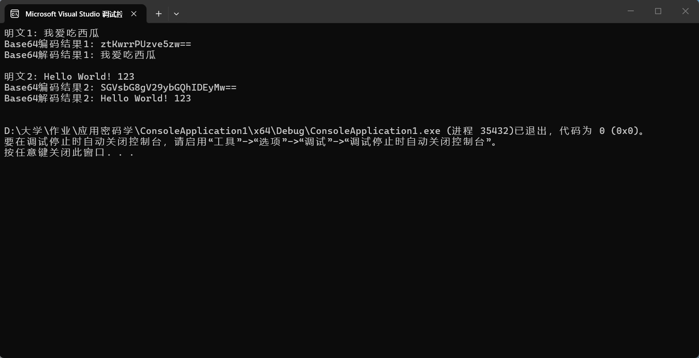

# 
Base64 编码原理与实现

## 一、基本原理
Base64 是二进制到文本的无损编码方式（不是加密算法），
核心作用是将任意二进制数据转换为 64 个可打印 ASCII 字符组成的字符串，解决二进制数据在文本协议（邮件、HTTP、URL 等）中无法直接传输的问题。

核心思想：把3 个 8 位（24 位）二进制字节，拆分为4 个 6 位二进制块；每个 6 位块对应 Base64 索引表中的 1 个可打印字符。
标准索引表：共 64 个字符，顺序为A-Z(0-25) → a-z(26-51) → 0-9(52-61) → +(62) → /(63)，补位符为=

补位规则：输入字节数不是 3 的倍数时，末尾补 0 至 24 位，最后用=填充输出：剩余 1 字节补 2 个=，剩余 2 字节补 1 个=

## 二、编码与解码过程
1. 编码过程
将输入二进制数据按3 字节为一组划分；
每组 24 位拆分为 4 个连续的 6 位二进制数；
每个 6 位数转十进制索引，查 Base64 表得到对应字符；
最后一组不足 3 字节时，按补位规则添加=。

2. 解码过程
去除输入字符串末尾的补位符=
将每个 Base64 字符转换为对应的 6 位二进制索引
4 个 6 位索引拼接为 24 位，拆分为 3 个 8 位原始字节
去掉末尾因补位产生的多余 0 字节，得到原始数据。

## 三、C++ 核心代码实现

> 
>#include <iostream>
#include <string>
using namespace std;
// Base64编码类
class Base64 {
private:
    // 标准Base64索引表
    const char base64Table[65] = "ABCDEFGHIJKLMNOPQRSTUVWXYZ"
                                 "abcdefghijklmnopqrstuvwxyz"
                                 "0123456789+/";
    // 解码辅助：字符转对应索引
    int charToIndex(char c) {
        if (c >= 'A' && c <= 'Z') return c - 'A';
        if (c >= 'a' && c <= 'z') return c - 'a' + 26;
        if (c >= '0' && c <= '9') return c - '0' + 52;
        if (c == '+') return 62;
        if (c == '/') return 63;
        return -1; // 非法字符直接忽略
    }
public:
    // 核心编码函数
    string encode(const string& rawData) {
        string result;
        int dataLen = rawData.length();
        int i = 0;
        unsigned char b1, b2, b3;
        while (i < dataLen) {
            b1 = (unsigned char)rawData[i++];
            // 第一个6位
            result += base64Table[(b1 >> 2) & 0x3F];
            if (i == dataLen) {
                // 剩余1字节，补2个=
                result += base64Table[(b1 << 4) & 0x3F];
                result += "==";
                break;
            }
            b2 = (unsigned char)rawData[i++];
            // 第二个6位
            result += base64Table[((b1 << 4) | (b2 >> 4)) & 0x3F];
            if (i == dataLen) {
                // 剩余2字节，补1个=
                result += base64Table[(b2 << 2) & 0x3F];
                result += "=";
                break;
            }
            b3 = (unsigned char)rawData[i++];
            // 第三、四个6位
            result += base64Table[((b2 << 2) | (b3 >> 6)) & 0x3F];
            result += base64Table[b3 & 0x3F];
        }
        return result;
    }
    // 核心解码函数
    string decode(const string& base64Data) {
        string result;
        int dataLen = base64Data.length();
        int i = 0;
        int idx1, idx2, idx3, idx4;
        while (i < dataLen) {
            // 跳过非法字符和补位符
            while (i < dataLen && charToIndex(base64Data[i]) == -1) i++;
            if (i >= dataLen) break;
            idx1 = charToIndex(base64Data[i++]);
            while (i < dataLen && charToIndex(base64Data[i]) == -1) i++;
            if (i >= dataLen) break;
            idx2 = charToIndex(base64Data[i++]);
            // 还原第一个原始字节
            result += (char)((idx1 << 2) | (idx2 >> 4));
            while (i < dataLen && charToIndex(base64Data[i]) == -1) i++;
            if (i >= dataLen || base64Data[i] == '=') break;
            idx3 = charToIndex(base64Data[i++]);
            // 还原第二个原始字节
            result += (char)((idx2 << 4) | (idx3 >> 2));
            while (i < dataLen && charToIndex(base64Data[i]) == -1) i++;
            if (i >= dataLen || base64Data[i] == '=') break;
            idx4 = charToIndex(base64Data[i++]);
            // 还原第三个原始字节
            result += (char)((idx3 << 6) | idx4);
        }
        return result;
    }
};

>int main() {
    Base64 codec;
    // 测试用例1：
    string m1 = "我爱吃西瓜";
    cout << "明文1: " << m1 << endl;
    string c1 = codec.encode(m1);
    cout << "Base64编码结果1: " << c1 << endl;
    string d1 = codec.decode(c1);
    cout << "Base64解码结果1: " << d1 << endl << endl;
    // 测试用例2：英文+符号
    string m2 = "Hello World! 123";
    cout << "明文2: " << m2 << endl;
    string c2 = codec.encode(m2);
    cout << "Base64编码结果2: " << c2 << endl;
    string d2 = codec.decode(c2);
    cout << "Base64解码结果2: " << d2 << endl << endl;
    return 0;
    }

## 四、运行结果

## 五、实验总结与分析
本质区别：Base64 是编码而非加密，无密钥、无保密性，仅改变数据表示形式；上次的 RC4 是对称加密算法，依赖密钥实现数据保密性。
补位作用：=仅用于对齐输出长度，不携带有效数据，解码时会自动忽略，不影响原始数据还原。
适用场景：专门用于解决二进制数据在文本通道的传输问题，常见于邮件附件、图片转文本、URL 参数传递等。
局限性：编码后数据体积会膨胀约 33%（3 字节变 4 字节），不适合大文件直接编码。