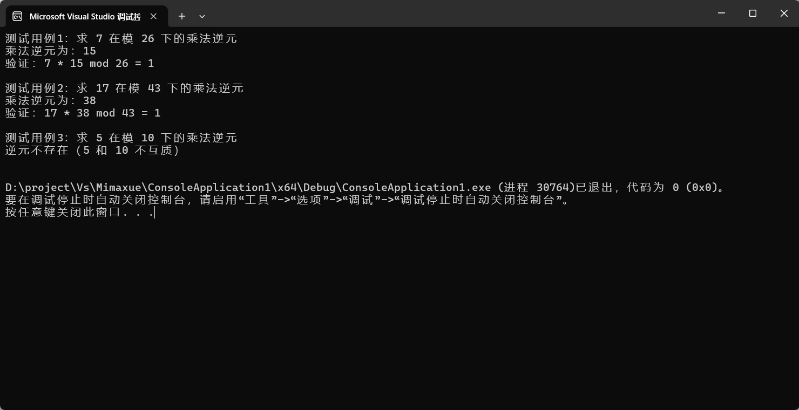

# 拓展欧几里得算法与乘法逆元实现

## 一、基本原理
1. 拓展欧几里得算法：在普通欧几里得（辗转相除）算法求最大公约数gcd(a,b)的基础上，同时找到整数 x 和 y，使得线性组合满足：
ax+by=gcd(a,b)

2. 乘法逆元：若整数a与模数m互质（即gcd(a,m)=1），则存在唯一整数x ∈ [1, m-1]，使得：
ax≡1(modm)
这个x即为a在模m下的乘法逆元。

## 二、算法过程
1. 拓展欧几里得算法（迭代版，避免递归栈溢出）
初始化：设x1=1, x2=0（记录 x 的迭代状态），y1=0, y2=1（记录 y 的迭代状态），r1=a, r2=b（记录余数的迭代状态）。
循环迭代：当r2≠0时，计算商q=r1/r2，更新余数r=r1%r2，并同步更新x=x1 - q*x2、y=y1 - q*y2，最后将所有状态移位（x1=x2, x2=x；y1=y2, y2=y；r1=r2, r2=r）。
结束条件：当r2=0时，r1即为gcd(a,b)，此时x1和y1满足a*x1 + b*y1 = gcd(a,b)。
2. 乘法逆元求解
调用拓展欧几里得算法，若gcd(a,m)≠1，则逆元不存在；
若存在，将得到的x调整到[1, m-1]的正整数范围内（公式：x = (x % m + m) % m）。

## 三、C++ 核心代码实现
> #include<iostream>
using namespace std;
// 拓展欧几里得算法类
class ExtendedEuclid {
public:
    // 拓展欧几里得算法：返回gcd(a,b)，同时通过引用返回x,y满足ax + by = gcd(a,b)
    int gcdExtended(int a, int b, int &x, int &y) {
        int x1 = 1, x2 = 0; // x1 = x_{k-2}, x2 = x_{k-1}
        int y1 = 0, y2 = 1; // y1 = y_{k-2}, y2 = y_{k-1}
        int r1 = a, r2 = b; // r1 = r_{k-2}, r2 = r_{k-1}
        while (r2 != 0) {
            int q = r1 / r2; // 商
            // 更新余数、x、y
            int r = r1 % r2;
            int x = x1 - q * x2;
            int y = y1 - q * y2;
            // 移位准备下一轮迭代
            x1 = x2;
            x2 = x;
            y1 = y2;
            y2 = y;
            r1 = r2;
            r2 = r;
        }
        x = x1;
        y = y1;
        return r1; // r1即为gcd(a,b)
    }
    // 求a在模m下的乘法逆元，不存在则返回-1
    int modInverse(int a, int m) {
        int x, y;
        int g = gcdExtended(a, m, x, y);
        if (g != 1) {
            return -1; // a和m不互质，逆元不存在
        } else {
            // 将x调整到[1, m-1]的正整数范围内
            int inv = (x % m + m) % m;
            return inv;
        }
    }
};
int main() {
    ExtendedEuclid ee;
    int a, m;
    // 测试用例1：7 mod 26的逆元
    a = 7;
    m = 26;
    cout << "测试用例1：求 " << a << " 在模 " << m << " 下的乘法逆元" << endl;
    int inv1 = ee.modInverse(a, m);
    if (inv1 == -1) {
        cout << "逆元不存在（" << a << " 和 " << m << " 不互质）" << endl << endl;
    } else {
        cout << "乘法逆元为：" << inv1 << endl;
        cout << "验证：" << a << " * " << inv1 << " mod " << m << " = " << (a * inv1) % m << endl << endl;
    }
    // 测试用例2：17 mod 43的逆元
    a = 17;
    m = 43;
    cout << "测试用例2：求 " << a << " 在模 " << m << " 下的乘法逆元" << endl;
    int inv2 = ee.modInverse(a, m);
    if (inv2 == -1) {
        cout << "逆元不存在（" << a << " 和 " << m << " 不互质）" << endl << endl;
    } else {
        cout << "乘法逆元为：" << inv2 << endl;
        cout << "验证：" << a << " * " << inv2 << " mod " << m << " = " << (a * inv2) % m << endl << endl;
    }
    // 测试用例3：5 mod 10（不互质，逆元不存在）
    a = 5;
    m = 10;
    cout << "测试用例3：求 " << a << " 在模 " << m << " 下的乘法逆元" << endl;
    int inv3 = ee.modInverse(a, m);
    if (inv3 == -1) {
        cout << "逆元不存在（" << a << " 和 " << m << " 不互质）" << endl << endl;
    } else {
        cout << "乘法逆元为：" << inv3 << endl;
        cout << "验证：" << a << " * " << inv3 << " mod " << m << " = " << (a * inv3) % m << endl << endl;
    }
    return 0;
}

## 四、运行结果

## 五、实验总结与分析
1. 逆元存在的核心条件：a 和模数 m 必须互质（gcd(a,m)=1），这是判断逆元是否存在的唯一标准。
2. 算法优势：拓展欧几里得算法在计算 gcd 的同时直接得到逆元，时间复杂度与普通欧几里得算法一致，为O(log min(a,m))，效率极高。
3. 结果调整：通过(x % m + m) % m将逆元调整到[1, m-1]的正整数范围内，避免出现负数结果。
4. 应用场景：乘法逆元是公钥加密算法（如 RSA）、椭圆曲线密码学中的核心运算，也用于解决同余方程问题。